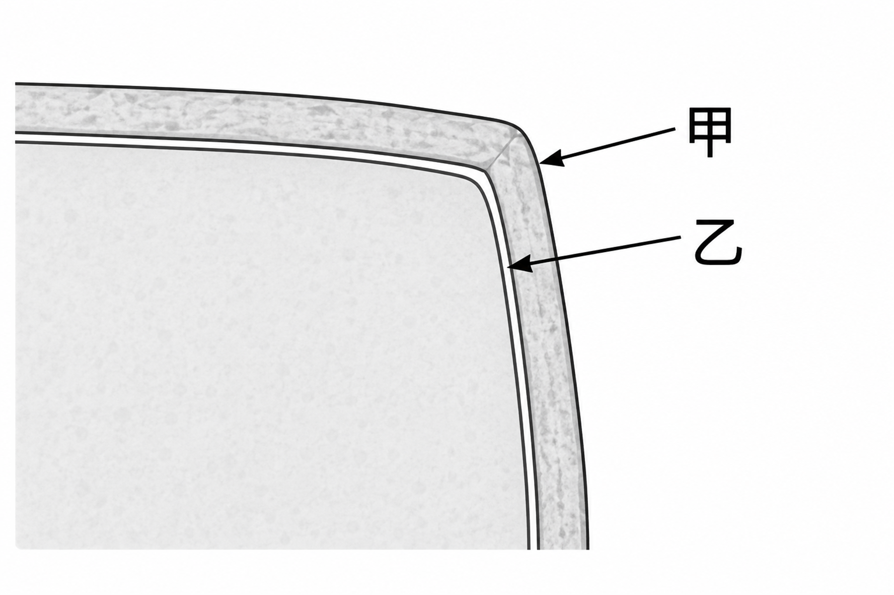

# 生物第一冊 2-2 細胞的構造｜圖片流程測試題

批次：`20260910_bio_b1_2-2_imageflow`  
難度：中等  
題號：`BIO_B1_U2-2_M_Q01`

請在（　）中選出最適當的答案。

1. （　）下圖為某植物細胞局部構造示意圖。甲、乙的箭頭各指向一個相鄰的外層構造。下列何者正確配對了甲、乙的構造名稱及其主要功能？

圖 1　植物細胞邊緣的局部示意圖。

| 選項 | 甲 | 乙 |
| --- | --- | --- |
| (Ａ) | 細胞膜：選擇性控制物質進出 | 細胞壁：幫助維持細胞形狀 |
| (Ｂ) | 細胞壁：幫助維持細胞形狀 | 細胞膜：選擇性控制物質進出 |
| (Ｃ) | 細胞膜：幫助維持細胞形狀 | 細胞壁：選擇性控制物質進出 |
| (Ｄ) | 細胞壁：選擇性控制物質進出 | 細胞膜：幫助維持細胞形狀 |
