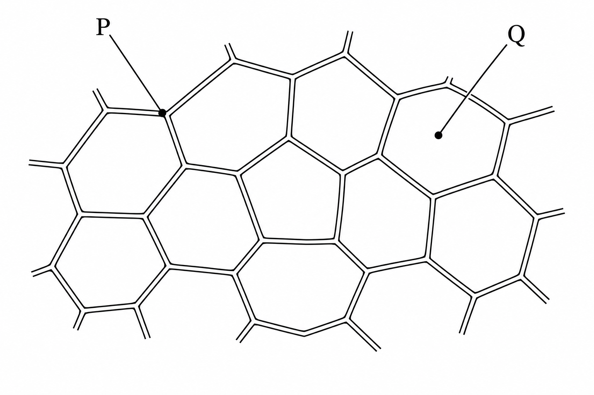
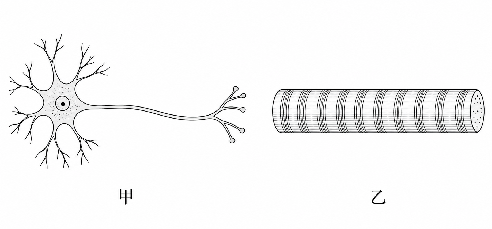
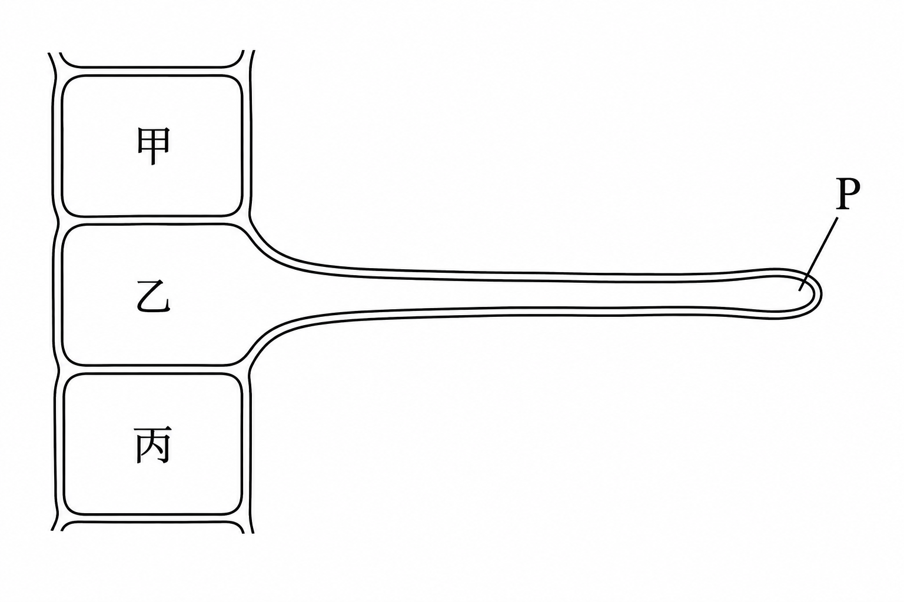
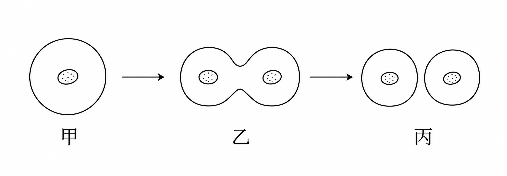
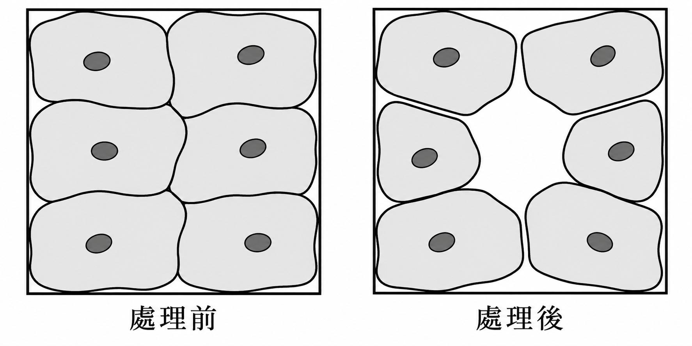
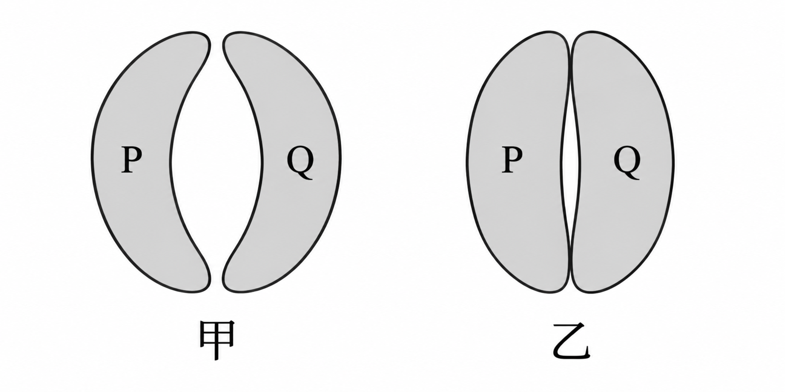
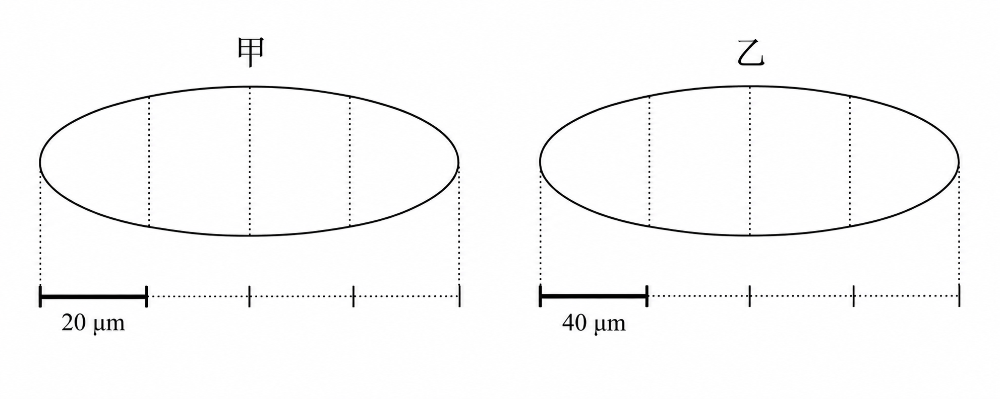

# 生物第一冊 2-1 生物體的基本單位

## 一、是非題

1. （　）同學從水草的葉與莖分別取樣，兩處都看見許多具有邊界的小單位。這項觀察可作為『水草不同部位由細胞構成』的證據。

2. （　）展覽說明虎克觀察的是軟木薄片中已死亡細胞留下的格狀構造。因此，『顯微鏡下仍看得到格狀邊界』就足以證明這些細胞仍活著。

3. （　）研究者觀察到肌肉中的細長細胞會縮短，且整束肌肉也隨之變短。這項記錄支持身體部位的功能與組成它的細胞活動有關。

4. （　）研究者在兩株同種幼苗的根部，各取一個面積相同的視野，分別數到 40 與 60 個細胞。只要拍攝倍率相同，就能據此斷定後一株整株所含的細胞總數較多。

5. （　）實驗室做出有薄膜邊界的小泡，但尚未確認它具有生命活動。僅憑『有薄膜邊界』，還不能將它認定為活的細胞。

## 二、單選題

6. （　）圖（一）模擬虎克觀察軟木薄片時所見的格狀構造。P、Q 為編輯加上的指示記號。展覽要在 P 的位置加上說明，哪一項最適合？

圖（一）軟木薄片觀察示意

(A) 活細胞的細胞核

(B) 活細胞正在流動的細胞質

(C) 死細胞留下的細胞壁

(D) 細胞進行收縮的位置

7. （　）科學展板有兩段文字：甲『在這片軟木薄片中，看到許多相鄰小格室』；乙『細胞是動、植物體構造與功能的基本單位』。編輯希望分開呈現觀察記錄與學說，下列安排何者適當？

(A) 甲列為觀察記錄，乙列為學說

(B) 兩者都列為單次觀察

(C) 兩者都列為尚未進行的實驗步驟

(D) 甲列為學說，乙列為單次觀察

8. （　）圖（二）的甲、乙分別是人體兩種細胞的簡圖，未按實際比例繪製。研究者要找出能透過延伸構造與其他細胞聯繫的細胞。哪一項判斷最合理？

圖（二）兩種人體細胞示意

(A) 乙，橫紋表示它主要負責運送氧氣

(B) 甲，分枝越多表示越適合收縮拉動骨骼

(C) 乙，細長形態足以證明它負責傳遞訊息

(D) 甲，分枝與長突起有利於訊息傳遞

9. （　）有人主張『同一個人體內的細胞，形狀應該都一樣』。下列新增記錄中，哪一項最能直接檢驗並否定這項主張？

(A) 同一人的紅血球呈雙凹圓盤狀，神經細胞有長突起

(B) 不同人的紅血球都可呈雙凹圓盤狀

(C) 同一人兩次取得的口腔皮膜細胞形態相近

(D) 同一人的口腔細胞在較高倍率下看起來較大

10. （　）研究小組想檢驗『排列越緊密的細胞層，越能阻擋微粒穿過』，以人工培養的細胞層進行比較，記錄如下。僅依本次設計，哪一項評析最恰當？

| 組別 | 排列 | 細胞層厚度 | 穿過的微粒數 |

| --- | --- | --- | --- |

| 甲 | 緊密 | 2 層 | 12 |

| 乙 | 疏鬆 | 1 層 | 35 |

(A) 甲的微粒較少，足以排除厚度的影響

(B) 排列與厚度同時不同，尚不能把差異只歸因於排列

(C) 應把微粒數較多的乙刪除，才能比較排列

(D) 兩組都有微粒穿過，表示排列一定毫無作用

11. （　）圖（三）是幼根表面局部簡圖，P 指向伸入土壤的一段細長突起。依圖中的細胞邊界，P 與哪一個細胞屬於同一個細胞單位？

圖（三）幼根表面局部示意

(A) 甲

(B) 丙

(C) 乙

(D) 甲與丙共同形成的新細胞

12. （　）研究者想在可彎動的模型上培養一束能主動拉動模型的細胞。三種候選細胞在相同環境下的記錄如下。若只根據本次記錄選擇，應採用哪一種？

| 細胞 | 施加適當刺激後的變化 |

| --- | --- |

| 甲 | 長度縮短，撤除刺激後可恢復 |

| 乙 | 將訊息傳到遠處，長度不變 |

| 丙 | 維持連續覆蓋，長度不變 |

(A) 乙，因能傳訊就一定能提供拉力

(B) 甲，因其能以長度變化產生拉動

(C) 丙，因連續覆蓋就一定能主動縮短

(D) 三者相同，因它們都是細胞

13. （　）自然社想比較植物與動物的表面是否都由細胞構成，已準備洋蔥表皮。下列何者最適合用作動物來源的比較材料？

(A) 食鹽結晶

(B) 塑膠保鮮膜

(C) 玻璃載玻片

(D) 口腔內側輕刮取得的皮膜樣本

14. （　）小組提出『每個細胞都能獨自完成生物體全部的生命活動』。甲資料顯示，單一草履蟲細胞可攝食並繁殖；乙資料顯示，人體成熟紅血球可運送氧氣，但不能自行分裂。依這兩筆資料，應如何修正主張？

(A) 部分生物可由一個細胞生活，多細胞生物的細胞可有不同分工

(B) 保留原主張，因草履蟲的例子已足夠

(C) 改為能運送氧氣的單位都不算細胞

(D) 改為所有細胞都不能自行完成生命活動

15. （　）圖（四）是在封閉培養室中連續追蹤同一個細胞所得的簡圖；期間沒有其他細胞進出，三幅圖依時間排列。哪一項說明最符合此記錄？

圖（四）封閉培養室中的連續觀察

(A) 後來的細胞是由培養液中的非生物物質直接組成

(B) 只是把顯微鏡倍率調高，所以細胞數變成兩個

(C) 原有細胞消失，兩個細胞從視野外移入

(D) 原有細胞在過程中分裂，形成兩個細胞

16. （　）介紹血液的短文寫道：『這類細胞隨血液流動，將氧氣運送到身體各處；人類成熟時通常呈雙凹圓盤狀。』短文指的是哪一種細胞？

(A) 肌肉細胞

(B) 神經細胞

(C) 紅血球

(D) 口腔皮膜細胞

17. （　）兩組學生都說看到『一格一格的細胞』，卻畫出不同形狀。老師要先判斷差異是否可能來自材料不同，應優先請他們補上哪組記錄？

(A) 繪圖者姓名與喜歡的顏色

(B) 樣本的生物種類、取樣部位與製片方式

(C) 小組人數與上課星期

(D) 顯微鏡外殼顏色與教室位置

18. （　）圖（五）為同一片人工培養皮膜在處理前、後的俯視簡圖，倍率相同；細胞沒有增減，但部分細胞的位置改變。假設微粒只能從細胞之間未被覆蓋的缺口通過，且其餘條件相同，下列哪一項預測最有根據？

圖（五）人工皮膜處理前後的細胞排列

(A) 細胞數未變，所以穿過的微粒數必定相同

(B) 細胞仍是扁平狀，所以排列改變不影響阻擋

(C) 處理後的細胞集中，表示整片屏障一定更完整

(D) 處理後中央出現缺口，微粒可能較容易穿過該處

19. （　）展覽草稿寫著『虎克觀察軟木中的格狀構造，並在同一次觀察中確立所有動、植物都由細胞構成』。哪一項修訂最適當？

(A) 保留全文，因一片軟木已包含所有動、植物的證據

(B) 保留虎克的觀察，將動、植物細胞學說改列為後續多位科學家研究的成果

(C) 將軟木改成石頭，其餘保留

(D) 將細胞名稱改成器官，其餘保留

20. （　）同一株植物的三處取樣記錄如下。若為這份記錄選擇一句摘要，哪一項最能同時涵蓋三列資料？

| 部位 | 細胞特徵 | 主要作用 |

| --- | --- | --- |

| 幼根表面 | 部分細胞有長突起 | 增加接觸土壤的面積 |

| 莖內部 | 細胞連成中空管狀構造 | 輸送水分 |

| 葉片表面 | 細胞緊密覆蓋 | 形成保護層 |

(A) 同株植物可由不同形態的細胞共同分工

(B) 同株植物各部位只需相同形態的細胞

(C) 所有細胞只要有長突起就負責輸水

(D) 各部位功能不同，表示不可能來自同株植物

## 三、題組

### 題組一 葉片表面的通道

閱讀下列資料，回答第 21～23 題。

葉片表面有成對的保衛細胞，兩細胞之間的空隙形成氣孔，是氣體通過的通道。研究者追蹤同一對保衛細胞，分別繪出甲、乙兩個狀態，如圖（六）。P、Q 是持續追蹤用的細胞記號；觀察期間沒有細胞新增、消失或移出視野。本圖為形態示意，不用來量測實際長度。

圖（六）同一對保衛細胞的兩個狀態

21. （　）只計算圖中帶有 P、Q 記號的構造，甲狀態共有幾個保衛細胞？

(A) 1 個，中央孔隙也是細胞的一部分

(B) 3 個，中央孔隙也是一個細胞

(C) 2 個，P 與 Q 分別位於兩個有邊界的單位

(D) 4 個，每個半月形都要分成兩個細胞

22. （　）甲變成乙時，圖中哪項變化最能說明通道開口縮小？

(A) 同一對保衛細胞形態改變，中央空隙變窄

(B) 中央空隙分裂為兩個新細胞

(C) P 細胞移出視野，原處留下空隙

(D) 兩個細胞合併成一個，將中央空隙吞入

23. （　）另一位同學懷疑乙的開口較窄只是拍攝或縮印倍率不同。若要在下一次觀察排除這種可能，哪一項記錄最有用？

(A) 只在乙圖旁寫上『已關閉』

(B) 改用不同葉片，且兩圖採不同縮印比例

(C) 只比較整張照片的紙張大小

(D) 固定倍率與輸出比例，並讓兩圖都保留同一刻度標記

### 題組二 紙上的大小與實際大小

閱讀下列資料，回答第 24～25 題。

自然社把兩個細胞的顯微照片整理成圖（七）。兩圖的拍攝倍率不同，各自保留正確比例尺，影像未經非等比例拉伸。請以細胞的水平最大長度和各自的比例尺比較；不需知道細胞種類。1 微米為千分之一毫米，圖中的 μm 表示微米。

圖（七）兩個細胞影像及各自比例尺

24. （　）依圖（七）各自的比例尺估計，乙細胞的實際長度約為甲的幾倍？

(A) 0.5 倍

(B) 2 倍

(C) 1 倍

(D) 4 倍

25. （　）編輯把圖（七）的乙圖連同比例尺一起等比例縮小成原來的一半，而 40 微米的文字標示不變。這時應如何判讀乙細胞的實際長度？

(A) 因標示數值不變，實際長度變成兩倍

(B) 因紙上長度減半，實際長度也減半

(C) 仍以縮小後的細胞與比例尺相較，實際長度估計不變

(D) 只要縮印過，就無法再使用比例尺