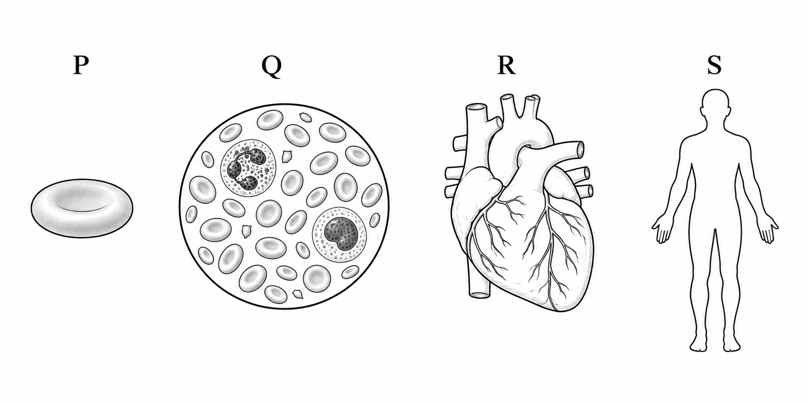
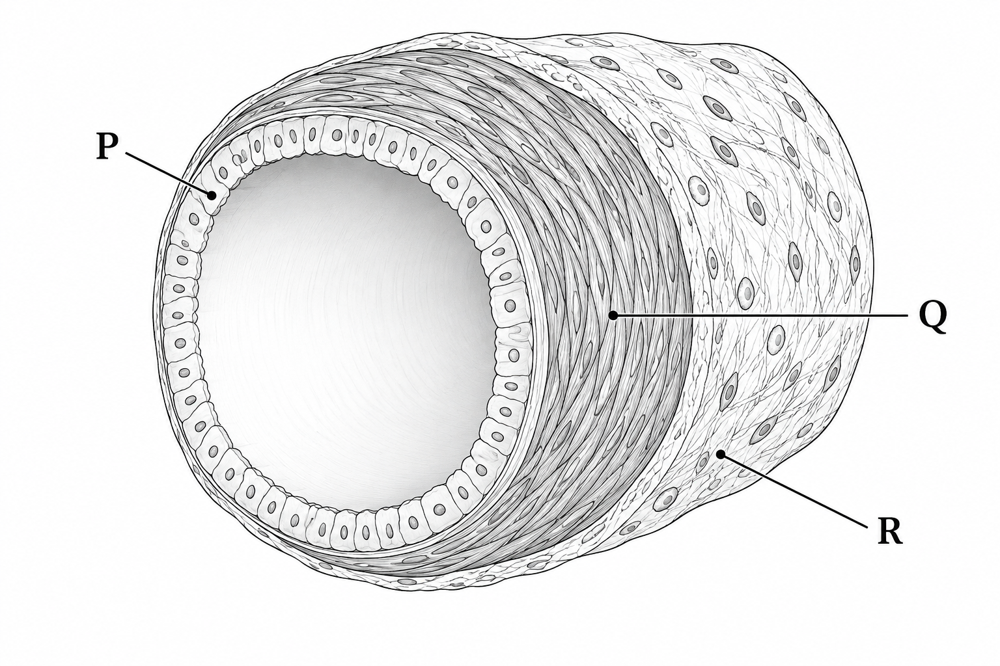
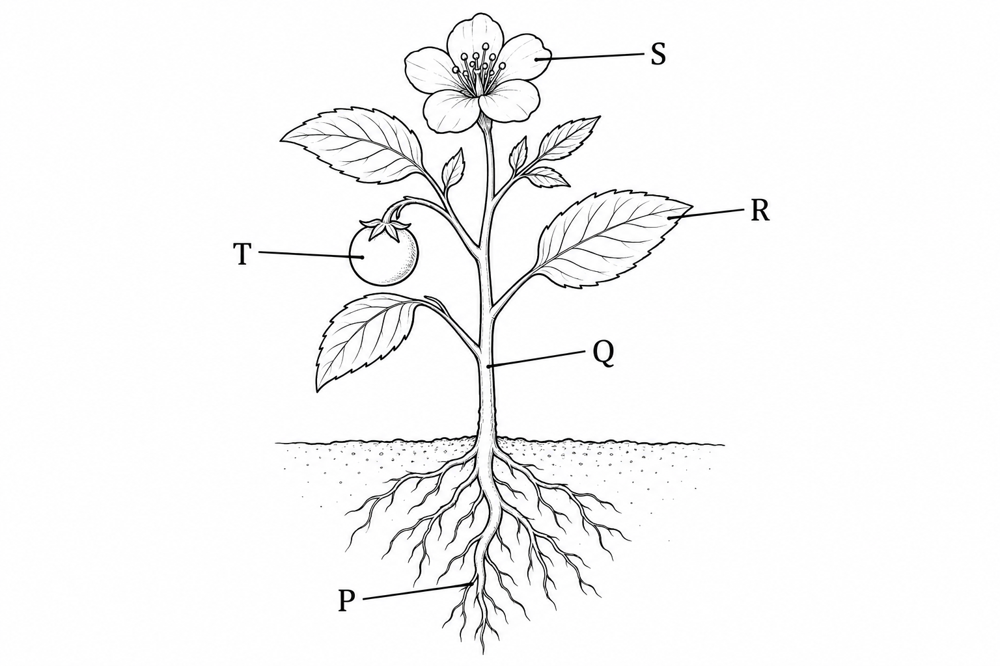
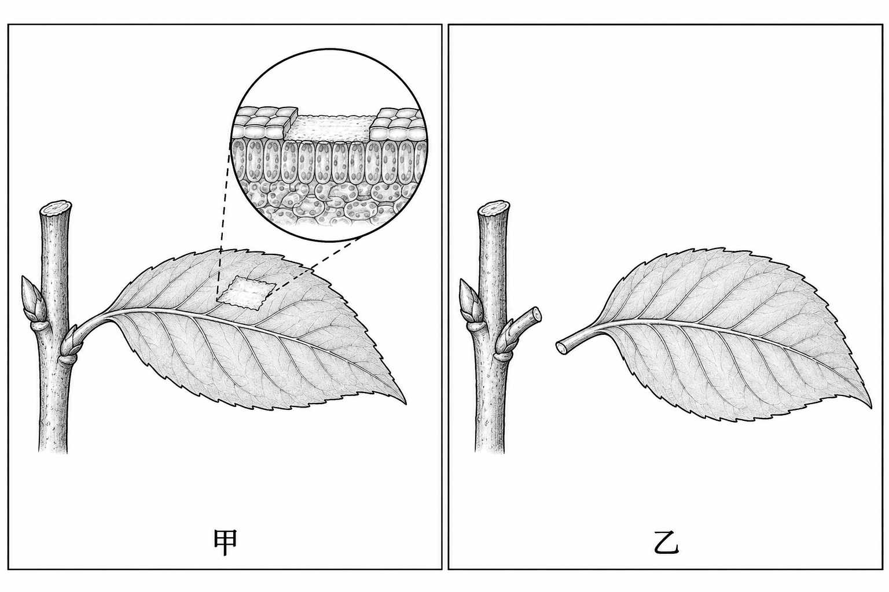
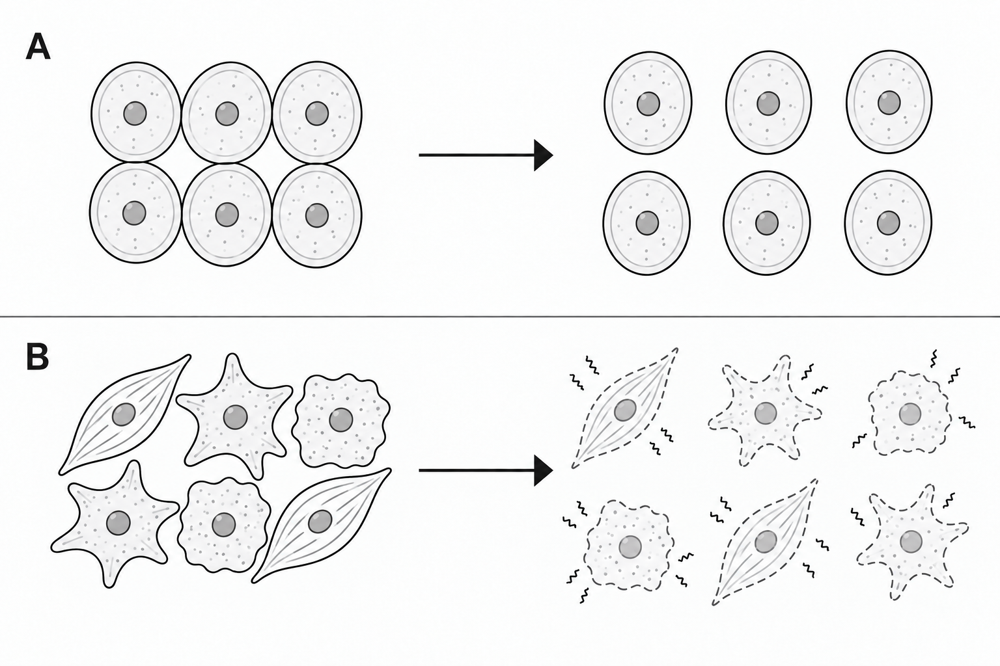
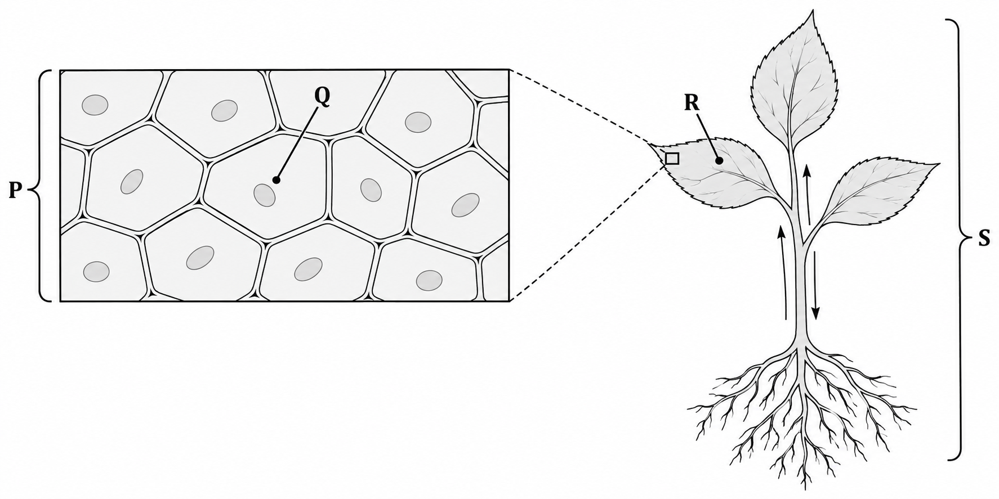
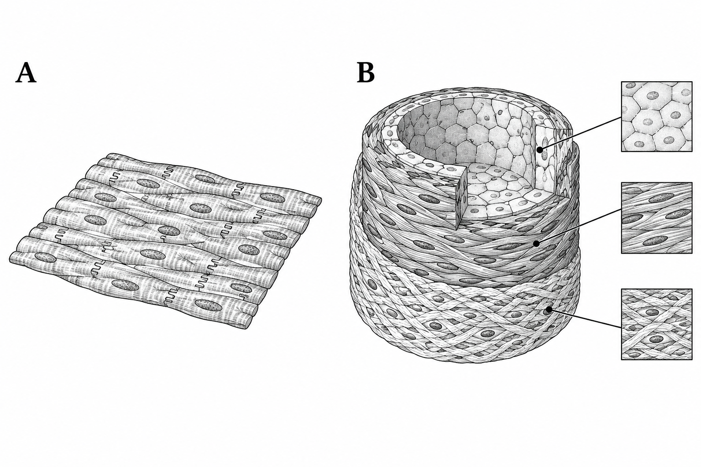

# 生物第一冊 2-4 生物體的組成層次

## 一、是非題

1. （　）校園觀察紀錄顯示，一株尚未開花結果的幼苗已有根、莖、葉。因此可判斷它已具有營養器官，但目前紀錄尚未顯示生殖器官。

2. （　）某段消化道的切片同時可見皮膜組織、肌肉組織與神經組織，這些組織共同完成推送食物的作用。依這些證據，可將整段構造歸為器官層次。

3. （　）研究者在一滴培養液中追蹤一隻眼蟲，記錄到它移動、生長並產生子代。這表示單細胞生物不必形成組織或器官，也能以一個細胞表現完整的生命現象。

4. （　）醫師說明，心臟受損會使血液輸送效率下降，並可能影響其他器官。這項說明可作為器官系統內各器官需要協調運作的例證。

5. （　）研究者以相同倍率，分別測量大象與小鼠各 10 個皮膚細胞，發現平均直徑相近。因此僅憑這項結果，就能證明大象全身各類細胞都不比小鼠大，且體型差異完全只來自細胞數量。

## 二、單選題

6. （　）圖（一）呈現人體的四種構造，圖中物件未按實際比例繪製。若依組成層次由簡單到複雜排列，下列何者正確？

圖（一）人體四種組成層次的圖卡

(A) R→Q→P→S

(B) Q→P→S→R

(C) P→Q→R→S

(D) S→R→Q→P

7. （　）研究室整理兩份人工培養構造的紀錄如下。僅依表中資訊，下列分類何者最合理？

| 樣本 | 觀察到的組成 | 整體表現 |

| --- | --- | --- |

| 甲 | 許多外形相近的細胞排列成薄層 | 共同覆蓋培養皿底部 |

| 乙 | 皮膜、肌肉與神經等不同組織相連 | 可規律推送管內物質 |

(A) 甲為組織，乙為器官

(B) 甲為細胞，乙為組織

(C) 甲為器官，乙為器官系統

(D) 甲與乙都只能算個體

8. （　）圖（二）為某動物管狀器官的局部剖面，P、Q、R 分別為皮膜組織、肌肉組織與結締組織。研究者只使 Q 層暫時失去作用，結果管內物質無法順利向前推送。下列解釋何者最合理？

圖（二）動物管狀器官的三層組織

(A) 只要 Q 層失去作用，便能證明 P、R 完全沒有功能

(B) Q 層是完整器官系統，可單獨形成個體

(C) P、Q、R 其實都是同一個細胞的不同部位

(D) Q 層是能收縮的組織，會參與整個器官的推送功能

9. （　）自然社把池水生物分成「一個細胞就是一個個體」與「由許多細胞分工形成個體」兩組。下列哪項觀察最適合放入前一組？

(A) 一隻草履蟲以單一細胞完成移動、攝食與繁殖

(B) 水螅的刺絲細胞與肌肉細胞執行不同工作

(C) 魚的鰓與心臟共同維持個體生存

(D) 水草的根、莖、葉具有不同功能

10. （　）學生主張：「一種組織只能出現在一種器官中。」下列哪項新證據最能直接否定這項主張？

(A) 胃由許多細胞構成，膀胱也由許多細胞構成

(B) 胃與膀胱切片中都可見構造相近、能收縮的肌肉組織，但兩者還各自搭配其他組織

(C) 同一胃切片的不同位置可看見細胞核

(D) 不同人的胃外形不完全相同

11. （　）圖（三）為一株正在開花結果的植物。老師要學生各取一個營養器官與一個生殖器官作為觀察材料，下列哪一組符合要求？

圖（三）開花結果植株的器官標記

(A) P 與 Q

(B) Q 與 R

(C) R 與 S

(D) S 與 T

12. （　）研究者在適宜條件下，分別觀察草履蟲與離體培養的人體肌肉細胞，結果如下。依表中資料，下列推論何者最適當？

| 觀察項目 | 草履蟲 | 人體肌肉細胞 |

| --- | --- | --- |

| 移動或收縮 | 有 | 有 |

| 攝取並消化食物 | 有 | 未觀察到 |

| 產生可獨立生活的子代 | 有 | 未觀察到 |

(A) 只要能運動的細胞，就一定是一個完整個體

(B) 草履蟲單一細胞表現的生命現象比該肌肉細胞完整

(C) 肌肉細胞不能獨立生活，所以不屬於細胞

(D) 草履蟲有多種功能，所以必由多種組織構成

13. （　）學生整理沙拉中的植物材料：萵苣葉、番茄果實、豌豆種子與胡蘿蔔根。哪兩項都屬於生殖器官？

(A) 萵苣葉與胡蘿蔔根

(B) 豌豆種子與胡蘿蔔根

(C) 萵苣葉與番茄果實

(D) 番茄果實與豌豆種子

14. （　）圖（四）記錄同種植物的兩種受損情形：甲只刮除葉面一小塊表皮，乙則從葉柄處移除整片葉。若依實際被移除構造的最高組成層次判斷，下列何者正確？

圖（四）葉片的兩種受損情形

(A) 甲涉及組織層次，乙涉及器官層次

(B) 甲與乙都只涉及細胞層次

(C) 甲涉及器官層次，乙涉及器官系統層次

(D) 甲與乙都涉及個體層次

15. （　）衛教資料寫道：「腎臟形成尿液，輸尿管將尿液送到膀胱，膀胱暫時儲存後再排出。」這段資料最能說明它們可合稱泌尿系統的哪項理由？

(A) 每個器官都由完全相同的細胞組成

(B) 其中任何一個器官都能單獨形成個體

(C) 所有器官都位在身體同一側

(D) 多個器官分擔彼此相關的工作

16. （　）顯微鏡下的生物 X 始終只有一個細胞，能攝食、對光線改變作出反應，並分裂成兩個可各自生活的 X。依此紀錄，X 最適合歸為何者？

(A) 動物的一個器官

(B) 多細胞生物的一種組織

(C) 一種單細胞生物

(D) 植物的一個器官系統

17. （　）圖（五）比較 A、B 兩種生物的細胞群。將細胞分開後，A 的各細胞仍可各自攝食與繁殖；B 的不同細胞離開原群體後，只保留部分功能且很快失去活性。下列推論何者最合理？

圖（五）A、B 兩種細胞群的分離觀察

(A) A 的細胞分工證據比 B 強

(B) B 的細胞彼此依賴程度可能比 A 高

(C) A 與 B 都必定沒有個體層次

(D) 細胞能否獨立生活與分工完全無關

18. （　）研究者只取得三種未知構造的下列資料。若分類時不加入資料以外的假設，哪項結論最恰當？

| 構造 | 已確認的證據 |

| --- | --- |

| 甲 | 一個細胞可攝食、排泄並產生可獨立生活的子代 |

| 乙 | 許多相近細胞連成薄層，共同阻擋微粒 |

| 丙 | 三種不同組織相連，共同使管內液體單向移動 |

(A) 乙必定是植物，丙必定是動物，因為資料已指出物種

(B) 甲、乙、丙都可判為器官，因為都具有功能

(C) 只有丙可判為個體，因為它的組成最複雜

(D) 甲可判為單細胞個體，乙可判為組織，丙可判為器官

19. （　）健康講義寫著：「血液會流經全身，所以血液是一個器官。」下列哪項修訂最適當？

(A) 血液只含一個細胞，所以歸為細胞

(B) 血液含多種血球與液體成分並共同運作，通常歸為組織

(C) 血液能流動，所以歸為個體

(D) 血液經過多個器官，所以本身就是器官系統

20. （　）某資訊圖把植物的組成畫成「細胞→組織→器官→個體」，並加註：「植物沒有器官系統，因此根、莖、葉不需要互相配合。」下列評析何者最合理？

(A) 加註錯誤，缺少器官系統這個層次不代表器官之間不會協調

(B) 加註正確，沒有器官系統就表示各器官彼此無關

(C) 箭頭錯誤，植物應由細胞直接形成個體

(D) 箭頭錯誤，植物在器官之後一定還有動物式的器官系統

## 三、題組

### 題組一 從表皮細胞到整株植物

閱讀下列資料，回答第 21～23 題。

圖（六）以同一株植物呈現四個組成層次。Q 指向葉片表皮中的一個細胞；P 框住由許多相近細胞排列成的表皮組織；R 指整片葉；S 指整株植物。圖中的箭頭表示根、莖、葉之間有物質運送，但不代表植物具有動物式的器官系統層次。

圖（六）植物由細胞到個體的組成關係

21. （　）圖中 Q 指向表皮內一個具有完整邊界的單位。Q 所指構造屬於哪一層次？

(A) 器官

(B) 組織

(C) 細胞

(D) 個體

22. （　）研究者確認 R 內除了 P，還有葉肉與輸導等組織，而且這些組織共同參與製造或運送養分。這項資料最支持下列哪項判斷？

(A) R 是由多種組織共同形成的器官

(B) P 是一個可獨立生活的個體

(C) Q 是由多個器官形成的系統

(D) S 缺少細胞與組織層次

23. （　）一位學生主張：「植物沒有器官系統，所以根部受損不會影響葉。」實驗中，研究者只破壞同株植物的一部分根，數小時後葉片萎凋；對照株未處理且未萎凋。依題幹與圖示，下列結論何者最合理？

(A) 結果支持該主張，因萎凋只發生在葉

(B) 結果證明根、莖、葉其實是同一個器官

(C) 結果證明葉片屬於器官系統

(D) 結果反駁該主張，顯示不同植物器官仍可能相互影響

### 題組二 人工心臟片的分類

閱讀下列資料，回答第 24～25 題。

研究團隊培養兩種構造。A 是由許多外形與功能相近的心肌細胞排列成的薄片，可同步收縮；B 則由心肌、內襯與結締等三種組織依固定位置組合，但團隊尚未確認這些組織能否協調完成推動液體的功能。圖（七）只呈現組成方式，不代表實際大小。

圖（七）兩種人工培養構造的組成方式

24. （　）依圖與紀錄判斷，A 最適合歸在哪一層次？

(A) 細胞，因薄片中只能有一個細胞

(B) 組織，因許多相近細胞排列並共同收縮

(C) 器官，因任何能收縮的構造都是器官

(D) 個體，因薄片可在培養液中存留

25. （　）團隊想把 B 稱為「人工器官」。下列哪項新增結果最能支持這個名稱？

(A) B 的外觀比 A 大，所以一定比 A 複雜

(B) B 的每個細胞都能離開構造後形成完整個體

(C) B 的三種組織可協調收縮、維持內襯並推動液體流動

(D) B 與 A 都使用相同顏色的培養液